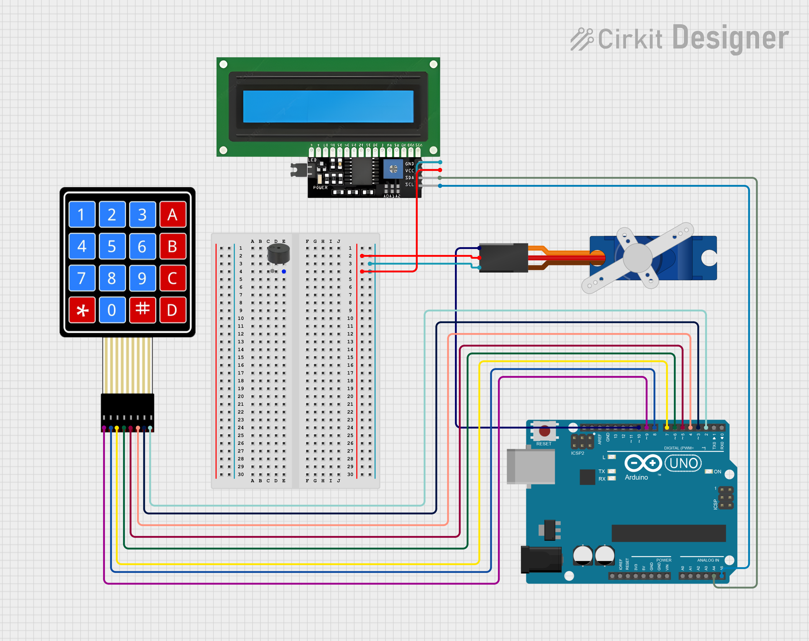

# 🔐 Arduino Password-Protected Door Lock System

This project is a secure door lock system built using **Arduino**, a **keypad**, **servo motor**, **LCD display**, and a **buzzer**. It allows access only through a predefined 4-digit password and provides a security alarm if the door remains open for too long.

---

## 📆 Features

* 4-digit password authentication
* Door unlocks using a servo motor
* Real-time feedback on an I2C LCD screen
* Buzzer alert if door stays open for over 2 minutes
* Easy keypad interface
* Reset or lock the system with key commands

---

## 🧰 Hardware Components

| Component                | Quantity  |
| ------------------------ | --------- |
| Arduino Uno              | 1         |
| 4x4 Keypad               | 1         |
| I2C LCD 20x4             | 1         |
| Servo Motor (e.g., SG90) | 1         |
| Buzzer                   | 1         |
| Jumper Wires             | As needed |

---

## 🧫 How It Works

### 🔑 Password System

```cpp
String password = "1234";
String input = "";
```

* User enters a 4-digit code via the keypad.
* If the input matches the password, the door unlocks (servo rotates).
* Door remains unlocked until the user presses `#` to relock or 2 minutes pass (alarm triggers).

### ⟳ Keypad Input Handling

```cpp
char key = keypad.getKey();
```

* `#` → Confirm input
* `*` → Clear current input
* Valid digits (`0`–`9`) are added to the password input

### 🔒 Door Lock Logic

```cpp
if (input == password) {
  myservo.write(90); // Unlock door
  doorlocked = false;
  doorOpenTime = millis();
}
```

* Servo rotates to unlock the door
* If door stays open for 2 minutes (`OPENALARM` = 120000 ms), buzzer starts and LCD shows a warning

---

## 💥 LCD Feedback

The LCD gives real-time instructions:

* `Enter Password:`
* `Access Granted` or `Wrong Password!`
* `Close Door!` if left open too long
* `Press # to lock` prompt for relocking

---

## 🔔 Timeout Alarm

```cpp
if (!doorlocked && (millis() - doorOpenTime >= OPENALARM)) {
  // Trigger LCD warning and buzzer
}
```

* After 2 minutes, user is warned to lock the door
* System waits until `#` is pressed to relock

---

## 💠 Required Libraries

Install the following libraries in your Arduino IDE:

* `LiquidCrystal_I2C`
* `Keypad`
* `Servo`

---

## 🚀 Getting Started

1. Connect the hardware components as per your circuit.
2. Upload the `project-code.ino` file to your Arduino board.
3. Power up your device.
4. Enter the password using the keypad.
5. If correct, the door unlocks.
6. Press `#` to lock it again after use.

---

## 🧰 Possible Improvements

* Password change functionality
* Save password using EEPROM
* Add fingerprint/RFID verification
* Add real-time clock (RTC) for access logs

---

## 📸 Demo / Circuit Diagram



---

## 👤 Author

**Your Name**
Ahmed Eid
Hannen Afifi
Fatma Mohamed

